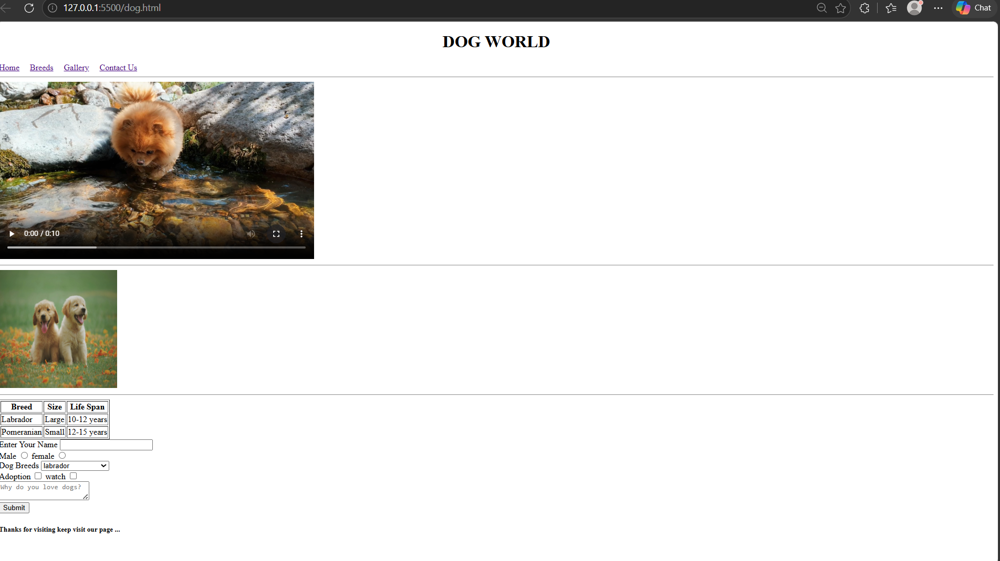
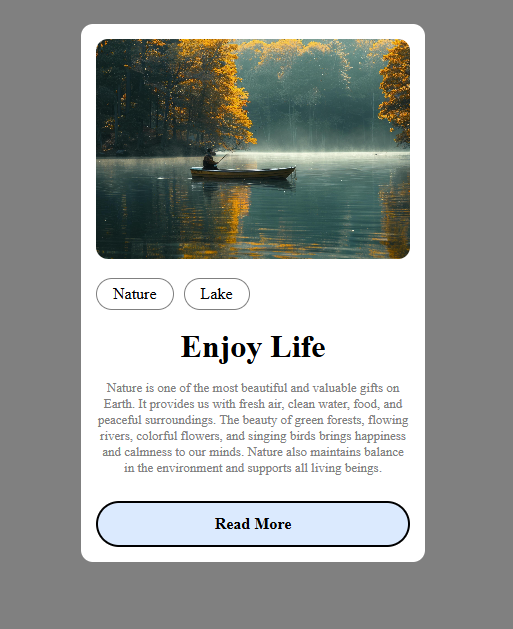

# Dog World – HTML Practice Project

This is my first web development project created while learning HTML.

## Project Screenshot

## What I Learned Today

- Basic HTML structure
- Headings and paragraphs
- Images and videos
- Forms and input fields
- Tables
- Navigation bar
- Lists
- Buttons
- Basic webpage structure

## Technologies Used

- HTML5

 ##  project2:
# Nature Card UI

A simple and responsive Nature Card UI built using HTML and CSS.  
This project displays a beautiful nature-themed card with an image, tags, heading, description, and a Read More button.

## Technologies Used

- HTML5
- CSS3

##  Features

- Nature image section
- Stylish category tags
- Center aligned content
- Modern UI design
- Beginner-friendly project

## project image

#day 3 learning

# Simple Colorful Webpage

This is a simple webpage created using HTML and CSS.  
It contains colorful boxes, a welcome section, and basic layout styling.

## Technologies Used
- HTML
- CSS

## What I Learned
- Flexbox
- CSS styling
- Positioning elements
- Creating layouts

